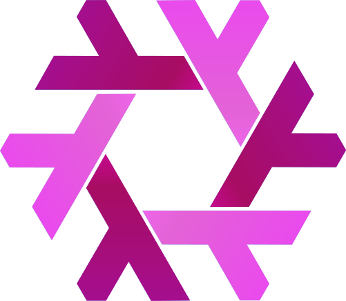

    
    <h1>❖ Ludovico's Dotfiles ❖</h1>
    
    
    
    

これは私の個人的なNixOS設定であり、進行中の作業です。私はこのセットアップを使用してNixを学び、NixOSを使って個人用のコンピュータを管理しています。これは、[hive](https://github.com/digga/hive)をベースにしています。

> **免責事項: この設定によって引き起こされた損害については、私の責任ではありません。自己責任で使用してください。**

[README-ja](README-ja.md)

## **スクリーンショット**

## **私が個人用のコンピュータで使用しているソフトウェア**

- Waylandコンポジター: [Hyprland](https://hyprland.org)
- Waylandバー: [Waybar](https://github.com/Alexays/Waybar)
- 通知マネージャー: [Mako](https://github.com/emersion/mako)
- エディター: [Neovim](https://neovim.io/)
- ターミナル: [Kitty](https://github.com/kovidgoyal/kitty)
- シェル: [Fish](https://fishshell.com/)
- ブラウザー: [Firefox](https://www.mozilla.org/en-US/firefox)

## **リソース**

NixおよびNixOSについて詳しく学ぶには、[nixos-manual](https://nixos.org/manual/nixos/stable/)と[nixpkgs-manual](https://nixos.org/manual/nixpkgs/stable/)をご覧ください。
