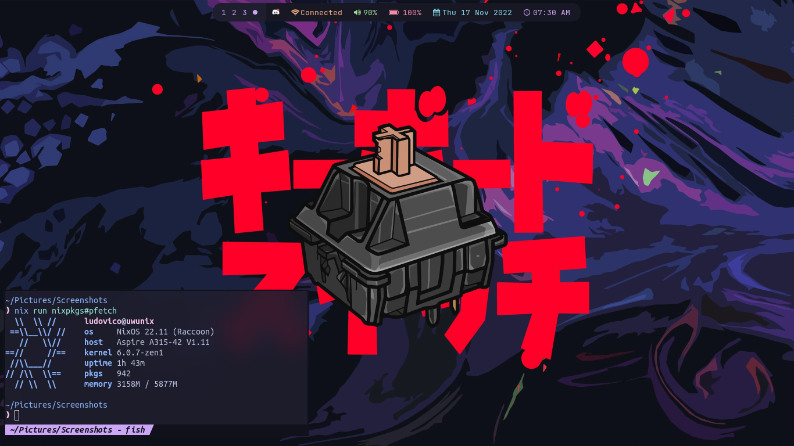

# My NixOS Configuration

This is my newest NixOS configuration. It is based on this [repo](https://github.com/Misterio77/nix-starter-configs/). 

Feel free to use it as a starting point for your own configuration.

## Screenshots

## Credits
- [NixOS](https://nixos.org/)
- [Misterio77](https://github.com/Misterio77/) for the nix-starter-configs 
- [Archcraft](https://archcraft.io/) for the Hyprland scripts