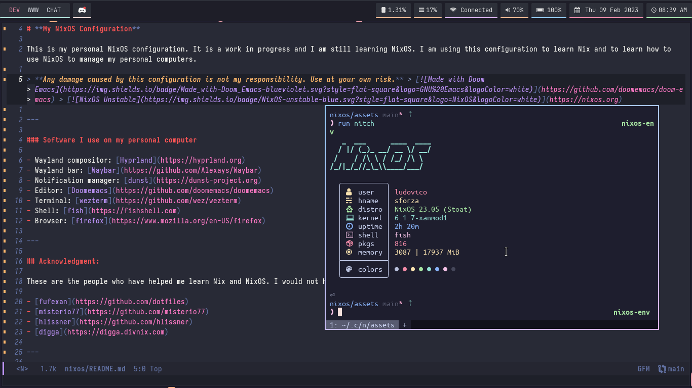

# Moving to [GitLab](https://gitlab.com/LudovicoSforza/dotfiles)

# My NixOS Dotfiles

This is my NixOS dotfiles based on [nixos-starter-config](https://github.com/Misterio77/nix-starter-configs). Feel free to use it as a starting point for your own configuration.

## Apps

| X                    	| Y                  	|
|----------------------	|--------------------	|
| Window Manager       	| Hyprland           	|
| Bar                  	| Waybar             	|
| Terminal             	| Kitty & Foot       	|
| Browser              	| Firefox & Chromium 	|
| Notification         	| Dunst              	|
| Application Launcher 	| Wofi & Bemenu      	|
| File Manager         	| Thunar             	|

## Screenshots

## Credits
### Fufexan - Misterio77 - Archcraft - pupbrained - NixOS
