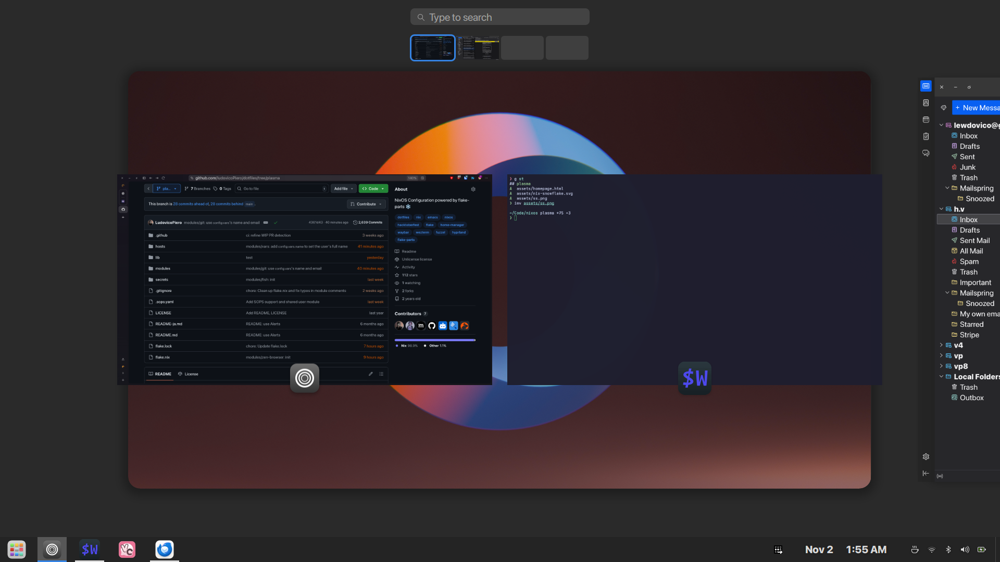

    
    <h1>❖ Ludovico's Dotfiles ❖</h1>
    

        
        
        
        
    

---

> [!WARNING]
> This is my personal NixOS configuration and a work in progress.
> I'm using it to learn Nix and manage my own systems.
> **Use at your own risk — I am not responsible for any damage caused.**

---

## **✨ Screenshots**

    

---

## **📚 Resources**

Explore the following resources to learn more about Nix and NixOS:

- [NixOS Manual](https://nixos.org/manual/nixos/stable/)
- [Nixpkgs Manual](https://nixos.org/manual/nixpkgs/stable/)

---

## **📂 Modules Structure**

This configuration is built upon a modular structure located in the `modules/` directory. The `modules/default.nix` file is designed to automatically import all `.nix` files within this directory, allowing for a clean and scalable way to manage different parts of the system.

The modules are organized as follows:

| Path         | Description                                                                           |
| ------------ | ------------------------------------------------------------------------------------- |
| `etc/`       | Core system-wide configurations.                                                      |
| `etc/fonts`  | Manages font settings for different use cases (main, terminal, CJK, emoji).           |
| `etc/shared` | Shared modules for users, variables, security, secrets (`sops`), and `hjem`.          |
| `etc/theme`  | GTK and Qt theming to ensure a consistent look and feel.                              |
| `hyprland/`  | Configuration specific to the Hyprland window manager.                                |
| `programs/`  | Manages configuration for user-level applications like shells, editors, and browsers. |
| `services/`  | Defines and configures system-level services such as greetd, pipewire, and more.      |

Each module is self-contained and can be configured through options defined within it, often located under the `mine` attribute set.

---

[README-ja](README-ja.md)
